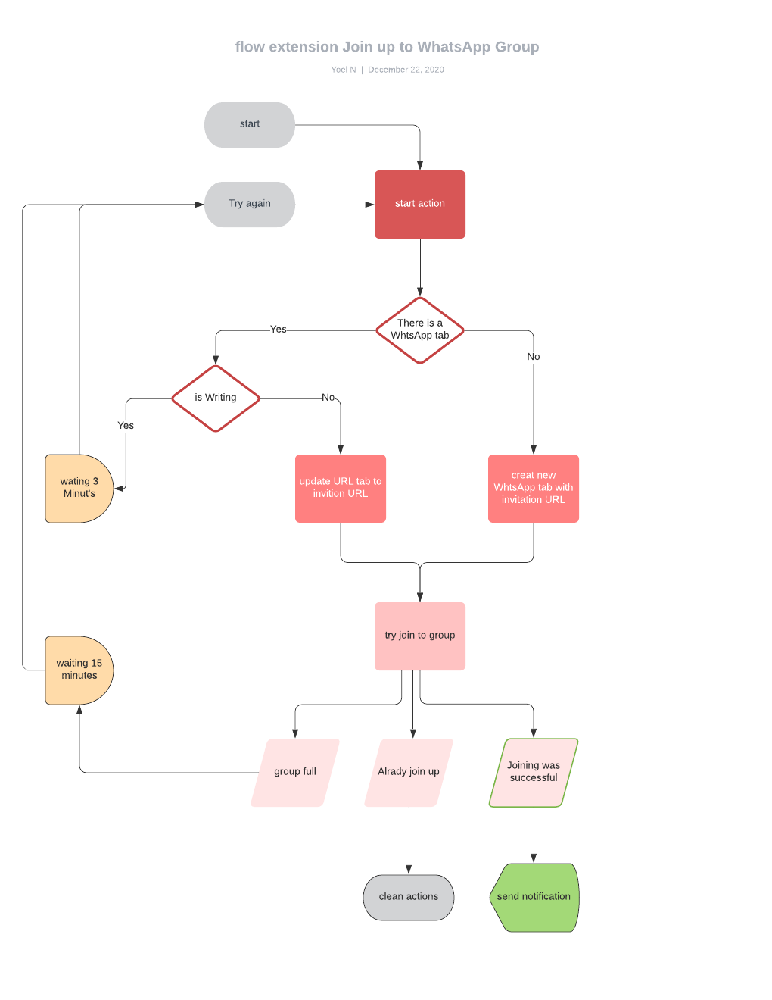

# whatsapp-join-to-full-group-chrome-extension
WhatsApp Group Snooze Registration Try again and again to sign up for a full group until a space becomes available


[](https://www.linkedin.com/in/yoel-naki-86896a186)
[](https://chrome.google.com/webstore/detail/whatsapp-join-to-full-gro/aalnhgolpbnnopmfbchloglegighlfed)

 
 

## Table of Contents

* [Quick Start](#quick-start)
* [File Structure](#file-structure)
* [How It Works](#how-it-works)
* [Technical Support or Questions](#technical-support-or-questions)
* [Social Media](#social-media)


## Quick start

### from store
You can take the extension from the [chrome web store](https://chrome.google.com/webstore/detail/whatsapp-join-to-full-gro/aalnhgolpbnnopmfbchloglegighlfed)

### Git-Clone
- Clone the Project: `$ git clone https://github.com/YOEL311/whatsapp-join-to-full-group-chrome-extension.git`.
- Either clone it using above command or simply download zip & extract to your desired directory.
### Installation
- Open Chrome => Go to settings => Extension => Toggle Developer mode on => Click on Load unpacked => select the cloned directory.
`Poof You have Succefully installed this extension!`:smile:
### How-To-Use
- Login in Whatsapp web.
- Open extension => Input url group invitation  => Click join

## File Structure
Within the download you'll find the following directories and files:

```
whatsapp-join-to-full-group-chrome-extension/
├── README.md
├── assets
│   ├── css
│   │   └── popup.css
│   ├── js
│   │   ├── background.js
│   │   ├── contact-script.js
│   │   └── popup.js
│   └── icons
│       └── icon.png
├── popup.html
└── manifest.json

```

## How It Works
Flowchart



## Technical Support or Questions

If you have questions or need help integrating the product, [contact me](https://api.whatsapp.com/send?phone=972548475559) me on whatsapp or email me at (yoel301@mail.com).


## Social Media

Linkedin: <https://www.linkedin.com/in/yoelNaki>

Dev: <https://dev.to/yoel>

Medium: <https://medium.com/@yoel301>


## My reputation

<a href="https://stackoverflow.com/users/9161478/yoel"></a>

<a href="https://www.codewars.com/users/YOEL311">
  </a>
</a>
